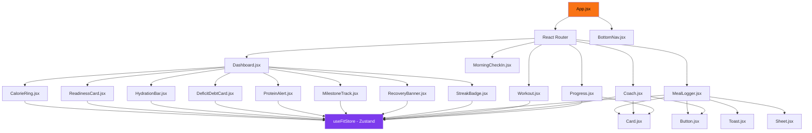
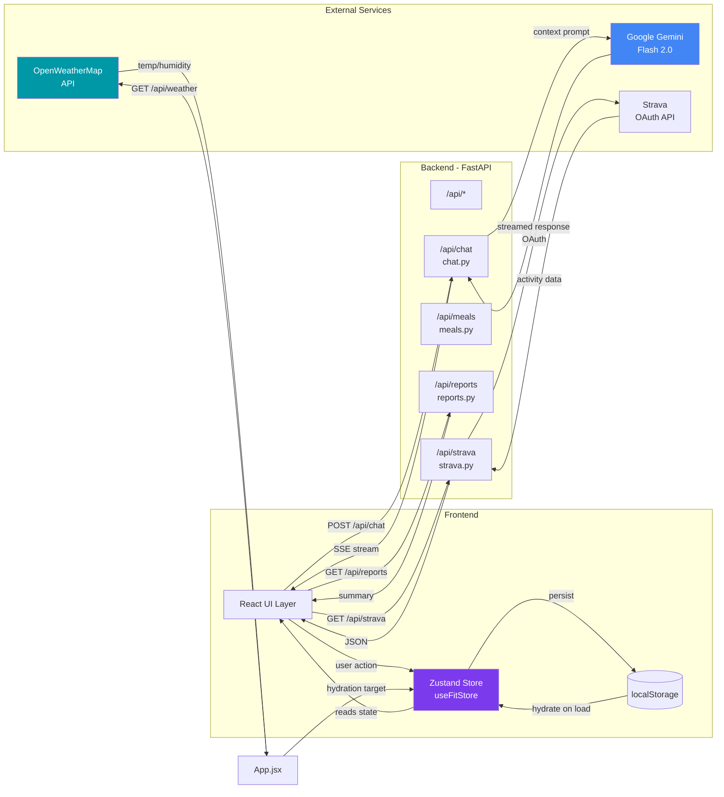
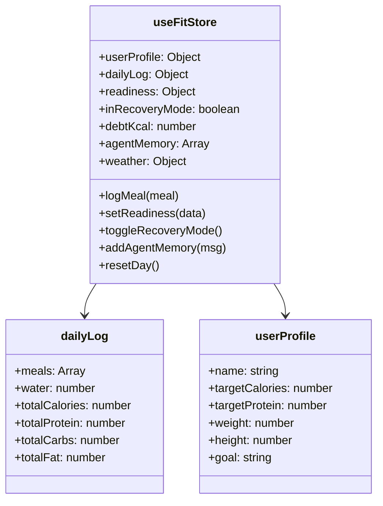

# FitAgent — Project Graph

> **Status:** Generated 2026-04-28 | All 18 Playwright tests passing ✅

---

## 1. Component Dependency Graph



---

## 2. Data Flow Graph



---

## 3. Backend Service Graph

```mermaid
graph TD
    ENTRY[main.py\nFastAPI App] --> CORS[CORS Middleware]
    ENTRY --> R1[/api/chat]
    ENTRY --> R2[/api/meals]
    ENTRY --> R3[/api/strava]
    ENTRY --> R4[/api/reports]
    ENTRY --> R5[GET /api/weather\nproxy in main.py]

    R1 --> GS[gemini_service.py\nGemini Flash 2.0]
    R3 --> WS[Strava OAuth Flow]
    R5 --> WX[weather_service.py\nOpenWeatherMap]
    R4 --> GS

    GS --> EXT1[Google AI API]
    WX --> EXT2[OpenWeatherMap API]

    style ENTRY fill:#f97316,color:#000
    style GS fill:#4285F4,color:#fff
    style WX fill:#0097a7,color:#fff
```

---

## 4. Zustand State Shape



---

## 5. Page Route Map

| Route | Page Component | Key Features |
|-------|----------------|--------------|
| `/` → redirect | — | Redirects to `/dashboard` |
| `/dashboard` | `Dashboard.jsx` | CalorieRing, MacroBars, Readiness, Hydration, Deficit |
| `/meals` | `MealLogger.jsx` | Log food, search, macro breakdown, meal list |
| `/workout` | `Workout.jsx` | Workout log, Strava sync |
| `/progress` | `Progress.jsx` | Weekly charts, streaks, milestones |
| `/coach` | `Coach.jsx` | AI chat with Coach Raj (Gemini Flash) |
| `/morning` | `MorningCheckIn.jsx` | Daily readiness check-in |

---

## 6. Playwright Test Coverage

| Test Suite | Tests | Status |
|------------|-------|--------|
| Dashboard — core metrics render | 5 | ✅ All pass |
| Navigation — bottom nav & routing | 5 | ✅ All pass |
| Meals Page — load & inputs | 2 | ✅ All pass |
| Coach Page — load, input, typing | 3 | ✅ All pass |
| Visual Snapshots — 3 pages | 3 | ✅ All pass |
| **TOTAL** | **18** | **✅ 18/18** |

> Test file: `frontend/tests/dashboard.spec.js`  
> Config: `frontend/playwright.config.js`  
> Run with: `cd frontend && npx playwright test`
